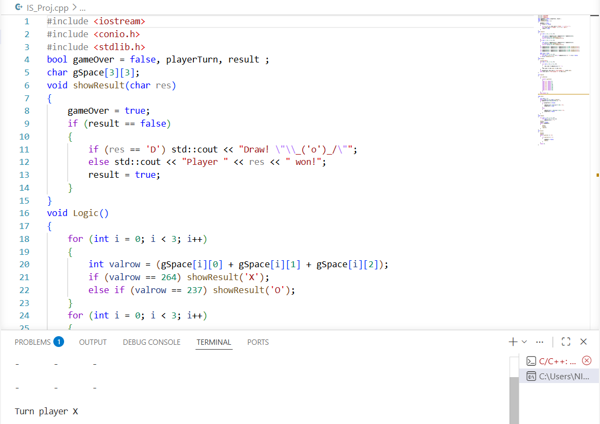
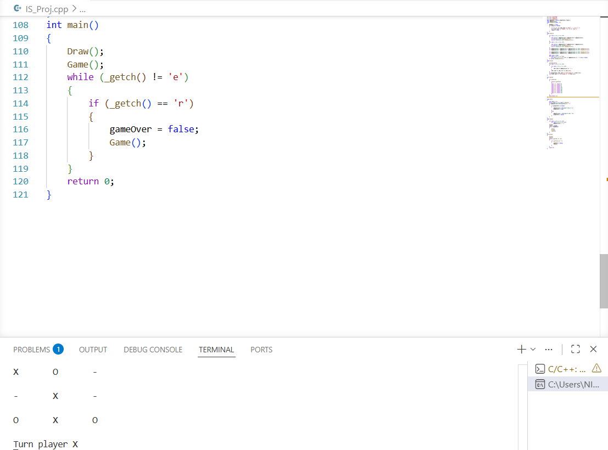
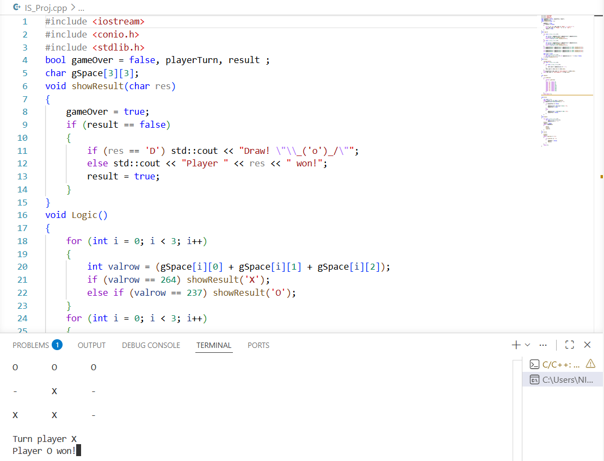
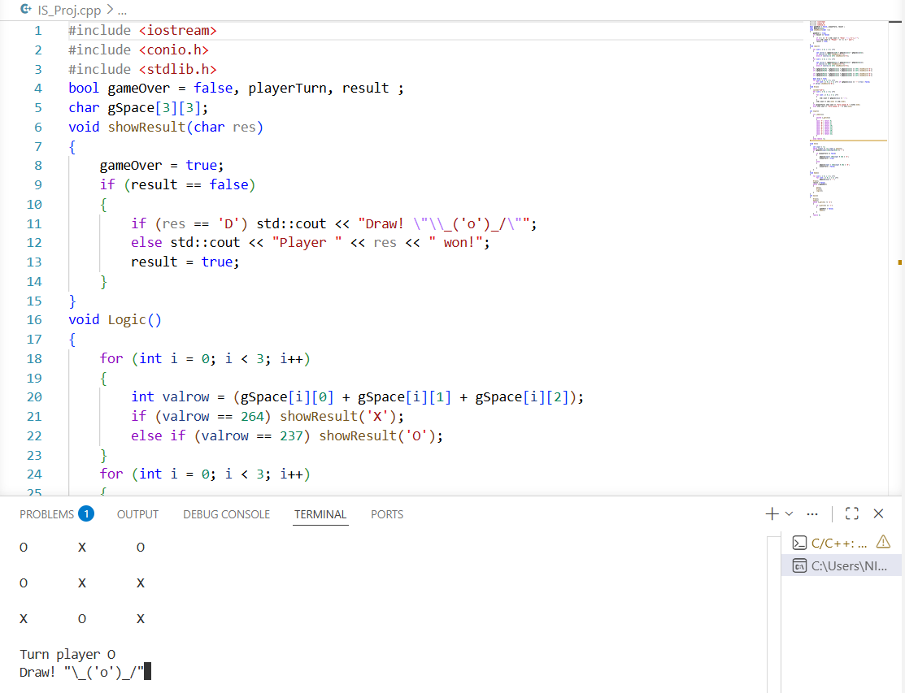

# Console Tic Tac Toe Using C++

A console-based Tic Tac Toe game developed in **C++** during internship training at **WingsIT Education and Solutions**.  
The project demonstrates programming fundamentals such as arrays, loops, functions, conditional statements, debugging techniques, and game logic implementation.

---

# Project Overview

This project is a two-player console game where players take turns placing their symbols (`X` and `O`) on a 3×3 game board. The program automatically checks for:

- Winning conditions
- Draw conditions
- Turn switching
- Board updates

The project was developed to strengthen:
- Logical thinking
- Problem-solving ability
- Console application development
- Object-Oriented Programming concepts

---

# Features

- 3×3 Console Game Board
- Two Player Gameplay
- Dynamic Board Updates
- Winner Detection Logic
- Draw Condition Checking
- Replay Functionality
- Keyboard-Based Input System
- Console User Interface

---

# Technologies Used

- C++
- Object-Oriented Programming (OOP)
- Arrays
- Functions
- Loops
- Conditional Statements
- Console-Based Development

---

# Project Structure

```text
console-tic-tac-toe-cpp/
│
├── .gitignore
├── LICENSE
├── README.md
│
├── docs/
│   ├── CONSOLE TIC TAC TOE USING C++.pdf
│   └── InternshipReport-format-and-Guideline.pdf
│
├── screenshots/
│   ├── gameplay-1.png
│   ├── gameplay-2.png
│   ├── winner-screen.png
│   └── draw-screen.png
│
├── src/
│   └── IS_Proj.cpp
```

---

# How the Project Works

1. The game board is initialized using a 3×3 array.
2. Players enter their moves alternately.
3. The board updates after every move.
4. The program checks rows, columns, and diagonals.
5. The winner or draw result is displayed automatically.
6. Players can restart the game after completion.

---

# Main Functions Used

| Function | Purpose |
|----------|----------|
| `Draw()` | Displays the game board |
| `Input()` | Handles player input |
| `Set()` | Places player symbols |
| `Logic()` | Checks winning conditions |
| `showResult()` | Displays game result |
| `Game()` | Controls overall gameplay |

---

# Screenshots

## Gameplay Screen 1



---

## Gameplay Screen 2



---

## Winner Screen



---

## Draw Screen



---

# How to Run

## Clone the Repository

```bash
git clone https://github.com/yourusername/console-tic-tac-toe-cpp.git
```

## Open the Project

Open the project using:
- VS Code
- CodeBlocks
- Dev C++
- Any C++ IDE

## Compile the Program

```bash
g++ src/IS_Proj.cpp -o game
```

## Run the Program

```bash
./game
```

---

# Internship Details

| Field | Information |
|------|-------------|
| Organization | WingsIT Education and Solutions |
| Internship Domain | C++ Development |
| Duration | 04 April 2026 – 20 May 2026 |

---

# Learning Outcomes

Through this project and internship, the following skills were improved:

- Logical thinking
- Problem-solving ability
- Debugging techniques
- Console application development
- Game logic implementation
- Independent coding skills
- Understanding of Object-Oriented Programming concepts

---

# Future Scope

The project can be enhanced further by adding:

- Single-player AI mode
- Graphical User Interface (GUI)
- Score tracking system
- Online multiplayer mode
- Sound effects and animations
- Difficulty level selection

---

# References

- Bjarne Stroustrup – *The C++ Programming Language*
- Herbert Schildt – *C++: The Complete Reference*
- WingsIT Education and Solutions Training Materials
- Online C++ Documentation and Tutorials

---

# Author

## Dhruv Kumar Roy

B.Tech CSE  
RKDF University, Ranchi

---

# License

This project is licensed under the MIT License.